# Home Hero — uygulama planı

## Ana uyarı

Bu hero uygulaması **eski CSS üstüne patch olarak yazılmayacak**. Önce [`styles/home.css`](styles/home.css) içinde çakışabilecek **tüm eski veya deneme hero kuralları temizlenecek**. Sonra **temiz, tek kaynaklı, responsive** `.home-hero` sistemi kurulacak.

**En kritik şart:** Cleanup yapılmadan yeni kod yazılmaz; aksi halde eski kurallar yeni sistemi bozar.

## Kritik riskler ve dikkat (uygulama sırasında)

1. **Gradient / pseudo box:** Pseudo-element’lerin **kendi kutusu veya sınırı** görünürse tekrar dikdörtgen / **panel** hissi oluşur. Sadece opacity + position yetmez; **negatif inset + büyük spread** şart.
2. **Clipping:** Glow kesiliyorsa müdahale **lokal** kalır: yalnızca `.home-hero` veya doğrudan hero’nun pseudo yapısı içinde çözülür. **Global / body / sayfa seviyesi** `overflow` veya layout kuralları gradient için **değiştirilmez**; global davranış bozulmaz.
3. **CTA / components kirlenmesi:** [`styles/components.css`](styles/components.css) içinde `.home-hero .hero__cta` gibi **hero-specific** kurallar **kalmamalı**; grep ile doğrulanır, kaldırılır veya [`styles/home.css`](styles/home.css)’e taşınır.
4. **Tablet typography çift kaynak:** Hero’ya özel override yalnızca **`.home-hero` scope**; global tipografi sistemi bozulmaz. Aynı breakpoint’te hero için `font-size` / `line-height` ve ilgili vertical gap **`components.css` ve `home.css` içinde tekrar edilmez**; **tek kaynak** korunur.
5. **Mobil H1 342px:** Güvenli default; canlıda **fazla dar** görünebilir — preview’da satır kırılımı okunabilirlik ile birlikte değerlendirilir, gerekirse revize.
6. **Navbar ve padding-top:** [`styles/components.css`](styles/components.css) içinde header **fixed / sticky / normal flow** ne ise, hero `padding-top` (130 / 180 / 132) o modele göre **yeniden okunur**; yanlış varsayım üst boşluğu bozar.

## Güncel desktop kararları

- **Label max-width:** 480px  
- **H1 max-width:** 600px  
- **Paragraph max-width:** 560px  
- **CTA aralıkları:** korunacak (desktop paragraf–CTA **56px** vb.)  
- **Gradient:** yeniden **soft atmospheric layer** ([`styles/home.css`](styles/home.css) içinde pseudo’lar)

## Breakpoint sistemi

- **Desktop:** varsayılan / pratikte **1025px üstü**  
- **Tablet:** `max-width: 1024px`  
- **Mobile layout:** `max-width: 768px`  
- **Narrow mobile CTA:** `max-width: 390px` (hero-özel davranış [`styles/home.css`](styles/home.css) içinde `.home-hero` scope)

---

## 1. Cleanup (bloklayıcı adım)

[`styles/home.css`](styles/home.css) içinde eski hero ile ilgili **tüm** kurallar silinecek. **Bu adım tamamlanmadan §3–6 kodu yazılmaz.**

- eski `.home-hero` kuralları  
- eski `.hero` kuralları  
- eski `.hero__content` kuralları  
- eski padding / min-height sistemleri  
- eski gradient / pseudo-element kuralları  
- eski max-width değerleri  
- eski responsive media query’leri  
- eski CTA override’ları  
- eski typography override’ları  

## 2. HTML kontrol

[`index.html`](index.html) içinde mevcut hero yapısı kontrol edilecek. **Label, H1, paragraph ve CTA doğrudan `section.home-hero` içindeyse HTML’e dokunulmayacak.** Yeni wrapper/container eklenmeyecek.

## 3. Desktop — [`styles/home.css`](styles/home.css)

Uygulama öncesi: [`styles/components.css`](styles/components.css) içinde `.site-header` **position** (static / sticky / fixed) doğrulanır; buna göre bu bölümdeki `padding-top` değerlerinin tasarım niyetiyle uyumu teyit edilir.

`.home-hero` için:

- `padding-left` / `padding-right`: **96px**  
- `padding-top`: **130px**  
- `padding-bottom`: **202px**  
- `min-height`: **936px**  
- label `max-width`: **480px**  
- H1 `max-width`: **600px**  
- paragraph `max-width`: **560px**  
- label–H1 gap: **16px** (ör. `.home-hero .hero__label + .hero__title { margin-top: 16px }` veya tek kaynak margin sistemi)  
- H1–paragraph gap: **32px**  
- paragraph–CTA gap: **56px**  

*(Tablet’te label–H1 **16px** global/`home-hero` ile korunur; tablet’te H1–paragraph **28px**, paragraf–CTA **48px** — bkz. §5.)*

## 4. Gradient

Gradient sistemi **yalnızca** [`styles/home.css`](styles/home.css) içinde `.home-hero::before` ve `.home-hero::after` ile kurulacak.

- Ana arka plan rengi korunur (`background-color` token).  
- İki radial layer: **left bottom** glow ~**40%** opacity, **right bottom** glow ~**60%** opacity.  
- Kaynak: `var(--gradient-radial-hero)` (yeni asset / dekoratif image yok).

Kurallar:

- Pseudo-element’ler section sınırından **taşmalı**; **negatif inset** kullanılmalı (sadece opacity/position yeterli değil).  
- Radial **spread büyük** olmalı (`background-size` vb.); dikdörtgen / **panel edge** görünmemeli — pseudo’nun **box sınırı** hissedilmemeli.  
- **Clipping (lokal):** Glow kesiliyorsa çözüm **yalnızca** `.home-hero` veya doğrudan hero’nun kendi lokal pseudo-element yapısı içinde yapılır. **Global / body / page-level** `overflow` veya benzeri kurallar **değiştirilmez**; global layout davranışı gradient için bozulmaz.  
- `pointer-events: none`  
- İçerik **üstte** (z-index); glow arkada.  
- [`styles/variables.css`](styles/variables.css) token değişikliği **yalnızca son çare**.

## 5. Tablet layout

`@media (max-width: 1024px)`:

- `padding-left` / `padding-right`: **48px**  
- `padding-top`: **180px**  
- `padding-bottom`: **200px**  
- `min-height`: **918px**  
- H1 `max-width`: **450px**  
- paragraph `max-width`: **530px**  
- paragraph–CTA gap: **48px**  
- H1–paragraph gap: **28px**  

## 6. Mobile layout

`@media (max-width: 768px)`:

- `padding-left` / `padding-right`: **24px**  
- `padding-top`: **132px**  
- `padding-bottom`: **132px**  
- label–H1 gap: **14px**  
- H1–paragraph gap: **24px**  
- paragraph–CTA gap: **40px**  
- H1 `max-width`: **342px** (güvenli default; preview’da **dar mı** diye okunabilirlik kontrolü)

## 7. CTA politikası

- [`styles/components.css`](styles/components.css): yalnızca **global / reusable** CTA görünümü, hover ve ortak button sistemi — dosya **hero-specific ile kirletilmez**.  
- Hero-özel CTA **width**, **placement** veya breakpoint davranışı: [`styles/home.css`](styles/home.css) içinde **`.home-hero` scope**.  
- Uygulama sonunda `components.css` içinde **`.home-hero`** veya **`.hero__cta`** ile birleşen **hero-only** width/padding kuralları **grep ile taranır**, kaldırılır veya `home.css`’e taşınır.

## 8. Tablet typography

769–1024 aralığında gerekirse önce yalnızca şu selector’larla düzenleme yapılacak:

- `.home-hero .hero__title`  
- `.home-hero .hero__text`  

**Case-study / contact selector’larına dokunulmayacak.**

Hero’ya özel typography override gerekiyorsa yalnızca **`.home-hero` scope** ile yazılır. **Global typography sistemi bozulmaz.** Aynı breakpoint’te hero için `font-size` / `line-height` ve ilgili vertical gap hem `components.css` hem `home.css` içinde **tekrar edilmez**; **tek kaynak** korunur.

## 9. Dosya sorumluluğu

**[`styles/home.css`](styles/home.css):** hero yüksekliği, padding, max-width, dikey ritim, gradient pseudo-element’ler, hero-specific CTA davranışı.

**[`styles/components.css`](styles/components.css):** global CTA, navbar, paylaşılan tipografi, reusable component stilleri.

**[`styles/variables.css`](styles/variables.css):** arka plan rengi, gradient token; token değişikliği yalnızca son çare.

**[`index.html`](index.html):** mevcut düz hero yapısı korunacak.

## 10. Preview kontrol

Uygulama sonrası canlı kontrol genişlikleri: **1440px**, **1024px**, **768px**, **390px**.

Kontrol listesi:

- sol hizalar  
- vertical rhythm  
- H1 kırılımı  
- label genişliği  
- paragraph genişliği  
- CTA konumu / genişliği  
- gradient edge / panel hissi; mobilde glow **kırpılması**  
- overflow (tercihen hero lokalinde; global layout için riskli değişiklik yok)  
- mobil H1 **342px** satır kırılımı (çok dar mı)  
- navbar modu ile **üst boşluk** tutarlılığı  

```mermaid
flowchart LR
  cleanup[1 Cleanup home.css]
  html[2 HTML kontrol]
  desktop[3 Desktop home-hero]
  gradient[4 Gradient pseudo]
  tablet[5 Tablet 1024]
  mobile[6 Mobile 768]
  cta[7 CTA policy]
  typo[8 Tablet typo home-only]
  preview[10 Preview]
  cleanup --> html
  html --> desktop
  desktop --> gradient
  gradient --> tablet
  tablet --> mobile
  mobile --> cta
  cta --> typo
  typo --> preview
```

